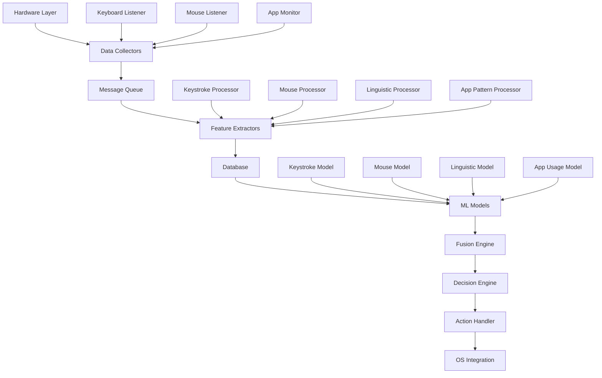
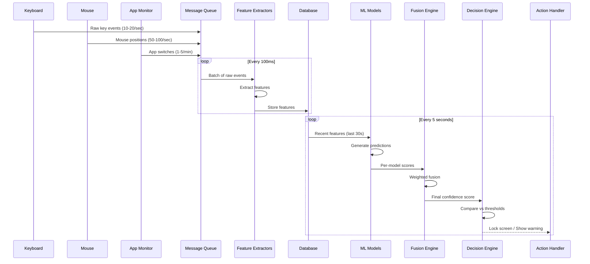
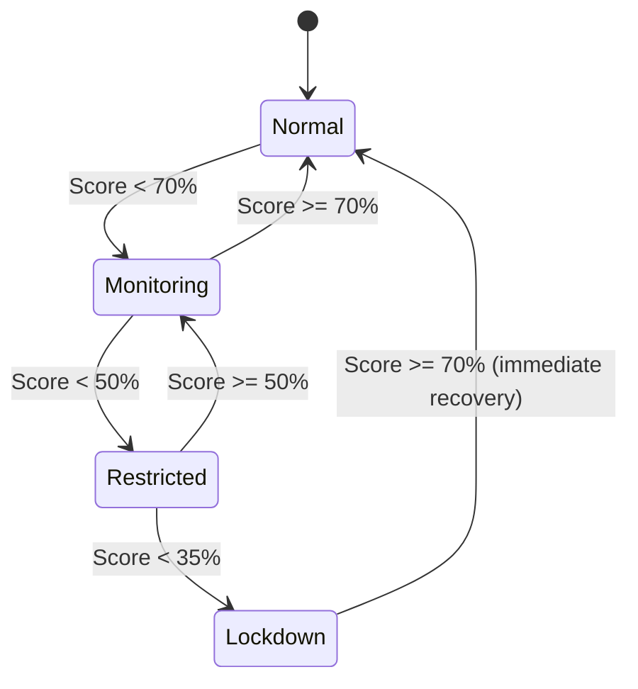

# SecLyzer - System Architecture

## Table of Contents
1. [Overview](#overview)
2. [System Components](#system-components)
3. [Data Flow Architecture](#data-flow-architecture)
4. [Module Details](#module-details)
5. [Technology Stack](#technology-stack)
6. [Database Schema](#database-schema)
7. [Communication Protocol](#communication-protocol)
8. [Project Structure](#project-structure)

---

## Overview

**SecLyzer** is a continuous authentication system that monitors user behavior through keyboard, mouse, and application usage patterns to maintain real-time confidence scoring of user identity.

### Core Principle
Instead of single-point authentication, SecLyzer maintains a **rolling confidence score (0-100%)** that updates every 5 seconds based on behavioral biometrics.

### Security Model
- **Score 90-100%**: Full access (normal operation)
- **Score 70-89%**: Monitoring mode (log anomalies)
- **Score 50-69%**: Restricted mode (lock sensitive apps)
- **Score <50%**: Lockdown (screen lock + require 2FA)

---

## System Components



### Component Breakdown

#### 1. **Data Collectors** (Rust)
- **Keyboard Listener**: Captures raw key events (press/release with timestamps)
- **Mouse Listener**: Captures mouse movements, clicks, scrolls
- **App Monitor**: Tracks active application, window switches

#### 2. **Message Queue** (Redis/ZeroMQ)
- High-throughput buffer between collectors and processors
- Prevents data loss during processing spikes

#### 3. **Feature Extractors** (Python/Rust)
- Transforms raw events into feature vectors
- Runs statistical calculations (mean, std dev, etc.)

#### 4. **Database** (SQLite + Time-Series DB)
- **SQLite**: Configuration, user profiles, model metadata
- **InfluxDB/TimescaleDB**: Time-series behavioral data

#### 5. **ML Models** (Python - scikit-learn/PyTorch)
- One model per behavioral modality
- Trained on user's historical data

#### 6. **Fusion Engine** (Python)
- Combines scores from all models using weighted average
- Applies temporal smoothing

#### 7. **Decision Engine** (Python)
- Compares fused score against thresholds
- Determines action (allow/warn/lock)

#### 8. **Action Handler** (Python + OS APIs)
- Executes security actions
- Sends notifications to user

---

## Data Flow Architecture



### Data Pipeline Stages

1. **Collection** (Real-time, Rust)
   - Raw events captured at hardware speed
   - Minimal processing, just timestamping

2. **Buffering** (Real-time, Message Queue)
   - Decouples fast collection from slower processing
   - Handles traffic bursts

3. **Feature Extraction** (Near real-time, 100ms batch)
   - Calculates dwell times, flight times, velocities
   - Generates statistical features

4. **Storage** (Batch writes, every 1 second)
   - Compressed time-series storage
   - Retention: 30 days rolling window

5. **Inference** (Every 5 seconds)
   - ML models score recent behavior
   - Lightweight inference (CPU only)

6. **Decision** (Every 5 seconds)
   - Single-threaded, deterministic
   - Logs all decisions for audit

---

## Module Details

### Module 1: Keystroke Collector (Rust)

**Purpose**: Capture keyboard events with microsecond precision

**Technology**: `rdev` or `evdev` (Linux raw device access)

**Data Captured**:
```rust
struct KeyEvent {
    timestamp_us: u64,        // Microseconds since epoch
    key_code: u32,            // Virtual key code
    event_type: EventType,    // Press or Release
    device_id: String,        // Keyboard hardware ID
}
```

**Output Format** (MessagePack to queue):
```
[timestamp, key_code, event_type]
```

**Performance Target**:
- Latency: <1ms from hardware event to queue
- CPU: <1% on idle, <3% during heavy typing

---

### Module 2: Mouse Collector (Rust)

**Purpose**: Capture mouse movements and clicks

**Data Captured**:
```rust
struct MouseEvent {
    timestamp_us: u64,
    x: i32,
    y: i32,
    event_type: MouseEventType, // Move, Click, Scroll
    button: Option<Button>,     // Left, Right, Middle
    scroll_delta: Option<i32>,
}
```

**Sampling Strategy**:
- Movement: Sample every 20ms (50 Hz)
- Clicks: Capture all events
- Scrolls: Capture all events

**Performance Target**:
- CPU: <2% average

---

### Module 3: App Monitor (Python - `psutil` + X11/Wayland)

**Purpose**: Track active application and window switches

**Data Captured**:
```python
{
    "timestamp": 1234567890,
    "app_name": "firefox",
    "window_class": "Navigator",
    "pid": 12345,
    "focus_duration_ms": 5000
}
```

**Privacy Protection**:
- Captures app name only (NOT window titles which may contain passwords)
- Hashes window classes

**Performance Target**:
- Polling: Every 500ms
- CPU: <0.5%

---

### Module 4: Keystroke Feature Extractor (Python)

**Input**: Stream of `KeyEvent` from queue

**Output**: Feature vectors

**Features Computed** (per 30-second window):
1. **Timing Features** (28 features):
   - Mean/Std/Min/Max of dwell times
   - Mean/Std/Min/Max of flight times
   - Dwell time for each finger (QWERTY position-based)
   
2. **Digraph Features** (100 features):
   - Top 100 most common 2-key combinations timing
   - Example: "th", "er", "in", "an", etc.

3. **Error Features** (4 features):
   - Backspace frequency
   - Backspace timing (fast = typo, slow = rethinking)

4. **Rhythm Features** (8 features):
   - Typing bursts vs pauses
   - Inter-key interval variance

**Total**: 140-dimensional feature vector

**Processing**:
```python
def extract_keystroke_features(events: List[KeyEvent]) -> np.ndarray:
    # Calculate dwell times
    # Calculate flight times
    # Compute statistics
    # Return feature vector
    pass
```

---

### Module 5: Mouse Feature Extractor (Python)

**Features Computed** (per 30-second window):
1. **Trajectory Features** (20 features):
   - Average velocity, acceleration
   - Curvature (straightness of paths)
   - Jerk (smoothness)

2. **Click Features** (10 features):
   - Click duration mean/std
   - Double-click speed
   - Drag distance distribution

3. **Micro-movement Features** (8 features):
   - Jitter when hovering
   - Tremor frequency

**Total**: 38-dimensional feature vector

---

### Module 6: Linguistic Feature Extractor (Python - spaCy/NLTK)

**Input**: Actual text typed (from keystroke reconstruction)

**Privacy Note**: This module is **OPTIONAL** and disabled by default

**If Enabled**:
- Text is hashed before storage
- Only statistical features stored

**Features** (12 features):
- Average word length
- Average sentence length
- Punctuation frequency
- Capitalization pattern score
- Common typo fingerprint (hashed)

---

### Module 7: ML Models

**STATUS:** Not implemented in this snapshot. Feature extraction is complete; model training and inference are planned for future phases.

#### Keystroke Model (Planned: Random Forest)
```python
# Input: 140-dimensional feature vector
# Output: Score 0-1 (how "normal" this typing is)
# PLANNED - Not yet implemented
```

#### Mouse Model (Planned: One-Class SVM)
```python
# PLANNED - Not yet implemented
```

#### App Usage Model (Planned: Markov Chain)
```python
# PLANNED - Not yet implemented
```

---

### Module 8: Fusion Engine

**STATUS:** Not implemented in this snapshot. Planned for future phase.

**Planned Algorithm**: Weighted Average with Time Decay

```python
# PLANNED - Not yet implemented
def fuse_scores(keystroke_score, mouse_score, app_score, linguistic_score):
    # Weights (sum to 1.0)
    w_key = 0.40
    w_mouse = 0.30
    w_app = 0.15
    w_ling = 0.15
    
    # Weighted sum
    raw_score = (w_key * keystroke_score + 
                 w_mouse * mouse_score + 
                 w_app * app_score + 
                 w_ling * linguistic_score)
    
    # Apply exponential moving average (smoothing)
    global previous_score
    alpha = 0.3  # Smoothing factor
    fused_score = alpha * raw_score + (1 - alpha) * previous_score
    previous_score = fused_score
    
    return fused_score * 100  # Convert to 0-100 scale
```

---

### Module 9: Decision Engine

**STATUS:** ✅ IMPLEMENTED (`processing/decision/decision_engine.py`)

**State Machine**:



**States and Thresholds**:
- **Normal** (≥70%): Full access, silent monitoring
- **Monitoring** (≥50%): Log events, enhanced monitoring
- **Restricted** (≥35%): Limited access, low confidence
- **Lockdown** (<35%): Very low confidence

**Key Features**:
- Confirmation logic: Requires 3 consecutive low scores before degrading
- Immediate recovery: High scores restore normal state instantly
- Publishes state changes to Redis `seclyzer:state_change`
- Does NOT execute system actions (delegated to Locking Engine)

---

### Module 10: Locking Engine (NEW)

**STATUS:** ✅ IMPLEMENTED (`processing/actions/locking_engine.py`)

**Purpose**: Execute system actions based on authentication state. Decoupled from Decision Engine for independent operation.

**Features**:
- Screen locking (configurable per state)
- Desktop notifications
- Can be enabled/disabled without affecting Decision Engine
- Listens to `seclyzer:state_change` Redis channel

**Configuration**:
```python
LockingEngine(
    enable_lock=True,           # Enable screen locking
    enable_notifications=True,  # Enable desktop notifications
    lock_on_restricted=False,   # Lock on RESTRICTED state
    lock_on_lockdown=True,      # Lock on LOCKDOWN state
)
```

**Architecture**:
```
┌─────────────────┐    ┌─────────────────┐    ┌─────────────────┐
│ Inference Engine│───▶│ Decision Engine │───▶│ Locking Engine  │
│                 │    │                 │    │   (Optional)    │
│ • Model Scoring │    │ • State Machine │    │ • Screen Lock   │
│ • Score Fusion  │    │ • Score History │    │ • Notifications │
└─────────────────┘    └─────────────────┘    └─────────────────┘
         │                       │                       │
         ▼                       ▼                       ▼
    Redis Pub/Sub          Redis Pub/Sub          System Actions
  scores:fused           state_change            (can be disabled)
```

**Usage**:
```bash
# Full protection (with locking)
seclyzer auth

# Scores only (for debugging)
seclyzer auth --no-locking
```

---

## Technology Stack

### Core Languages
- **Rust**: Data collectors (performance-critical, low-level system access)
- **Python 3.11+**: Feature extraction, ML, decision logic

### Libraries & Frameworks

#### Rust
- `rdev` or `evdev`: Keyboard/mouse listening
- `serde`: Serialization
- `crossbeam`: Multi-threading
- `zeromq` or `redis-rs`: Message queue client

#### Python
- **ML**: `scikit-learn`, `PyTorch` (if using neural networks)
- **Data**: `numpy`, `pandas`, `polars`
- **NLP**: `spaCy` (for linguistic features)
- **System**: `psutil`, `python-xlib` (app monitoring)
- **Database**: `sqlalchemy`, `influxdb-client`
- **Queue**: `pyzmq` or `redis-py`

### Infrastructure
- **Message Queue**: Redis (simpler) or ZeroMQ (faster)
- **Time-Series DB**: InfluxDB or TimescaleDB
- **Config DB**: SQLite
- **Model Storage**: Pickle or ONNX files

### OS Integration
- **Linux**: DBus for screen locking, systemd for service management
- **Notifications**: `libnotify`

---

## Database Schema

### SQLite Schema (Metadata)

```sql
-- User profile
CREATE TABLE user_profile (
    user_id INTEGER PRIMARY KEY,
    username TEXT NOT NULL,
    created_at TIMESTAMP,
    training_status TEXT,  -- 'initial', 'training', 'active'
    last_updated TIMESTAMP
);

-- Model metadata
CREATE TABLE models (
    model_id INTEGER PRIMARY KEY,
    user_id INTEGER,
    model_type TEXT,  -- 'keystroke', 'mouse', 'app', 'linguistic'
    version TEXT,
    trained_at TIMESTAMP,
    accuracy REAL,
    model_path TEXT,
    FOREIGN KEY(user_id) REFERENCES user_profile(user_id)
);

-- Configuration
CREATE TABLE config (
    key TEXT PRIMARY KEY,
    value TEXT,
    updated_at TIMESTAMP
);

-- Audit log
CREATE TABLE audit_log (
    id INTEGER PRIMARY KEY AUTOINCREMENT,
    timestamp TIMESTAMP,
    event_type TEXT,  -- 'score_change', 'state_transition', 'lockdown'
    confidence_score REAL,
    state TEXT,
    details TEXT
);
```

### InfluxDB Schema (Time-Series Data)

```
# Measurement: keystroke_features
# Tags: user_id, device_id
# Fields: dwell_mean, dwell_std, flight_mean, flight_std, ... (140 fields)
# Timestamp: event time

# Measurement: mouse_features
# Tags: user_id
# Fields: velocity_mean, curvature, jerk, ... (38 fields)

# Measurement: confidence_scores
# Tags: user_id
# Fields: keystroke_score, mouse_score, fused_score, state
```

---

## Communication Protocol

### Message Queue Format (MessagePack)

#### Keystroke Event
```python
{
    "type": "keystroke",
    "timestamp": 1234567890123,  # microseconds
    "key": 65,  # Virtual key code
    "event": "press",  # or "release"
    "device": "keyboard_0"
}
```

#### Mouse Event
```python
{
    "type": "mouse",
    "timestamp": 1234567890123,
    "x": 500,
    "y": 300,
    "event": "move",  # or "click", "scroll"
    "button": None,
    "scroll_delta": None
}
```

#### App Event
```python
{
    "type": "app",
    "timestamp": 1234567890123,
    "app_name": "firefox",
    "window_class": "Navigator",
    "event": "focus"
}
```

### Internal API (Between Modules)

#### Feature Extractor → ML Model
```python
# HTTP REST API (Flask/FastAPI) or direct Python function calls
POST /predict/keystroke
{
    "features": [0.12, 0.45, ...],  # 140-dim vector
    "timestamp": 1234567890
}

Response:
{
    "score": 0.92,
    "confidence": 0.85
}
```

---

## Project Structure

```
SecLyzer/
├── collectors/              # Rust workspace
│   ├── keyboard_collector/
│   │   ├── src/
│   │   │   └── main.rs
│   │   └── Cargo.toml
│   ├── mouse_collector/
│   │   ├── src/
│   │   │   └── main.rs
│   │   └── Cargo.toml
│   └── app_monitor/
│       └── (Python service)
│
├── processing/              # Python package
│   ├── extractors/
│   │   ├── keystroke_extractor.py
│   │   ├── mouse_extractor.py
│   │   └── linguistic_extractor.py
│   ├── models/
│   │   ├── keystroke_model.py
│   │   ├── mouse_model.py
│   │   └── app_model.py
│   ├── fusion/
│   │   └── fusion_engine.py
│   └── decision/
│       └── decision_engine.py
│
├── storage/
│   ├── database.py          # SQLite wrapper
│   ├── timeseries.py        # InfluxDB wrapper
│   └── schemas/
│       ├── sqlite_schema.sql
│       └── influx_schema.flux
│
├── common/
│   ├── config.py            # Configuration management
│   ├── logging.py           # Centralized logging
│   └── message_queue.py     # Queue abstraction
│
├── daemon/
│   └── (Planned: Main orchestrator for training/inference)
│
├── ui/
│   └── (Planned: Web dashboard and REST API)
│
├── tests/
│   ├── test_collectors.rs
│   ├── test_extractors.py
│   └── test_models.py
│
├── data/                    # Persisted data (gitignored)
│   ├── models/              # Trained model files
│   ├── databases/           # SQLite files
│   └── logs/
│
├── config/
│   └── seclyzer.yml         # Main configuration
│
├── scripts/
│   ├── install.sh           # System setup
│   ├── setup_db.sh
│   └── start_services.sh
│
├── ARCHITECTURE.md          # This document
├── README.md
└── requirements.txt         # Python dependencies
```

---

## Deployment Architecture

### Process Model (5 Long-Running Processes)

1. **Keyboard Collector** (Rust binary)
   - Runs as root (requires raw device access)
   - Publishes to Redis queue

2. **Mouse Collector** (Rust binary)
   - Runs as root
   - Publishes to Redis queue

3. **App Monitor** (Python service)
   - Runs as user
   - Publishes to Redis queue

4. **Feature Processor** (Python service)
   - Subscribes to Redis queue
   - Writes to InfluxDB

5. **Inference & Decision Engine** (Python service)
   - Reads from InfluxDB every 5 seconds
   - Runs ML models
   - Controls screen locking

### Systemd Integration

```ini
# /etc/systemd/system/seclyzer.service
[Unit]
Description=SecLyzer Behavioral Authentication
After=network.target redis.service influxdb.service

[Service]
Type=simple
User=root
ExecStart=/usr/local/bin/seclyzer_daemon
Restart=always

[Install]
WantedBy=multi-user.target
```

---

## Performance Targets

| Component | CPU Usage | Memory | Latency |
|-----------|-----------|--------|---------|
| Keyboard Collector | <1% | 5 MB | <1 ms |
| Mouse Collector | <2% | 8 MB | <5 ms |
| App Monitor | <0.5% | 10 MB | 500 ms |
| Feature Extractor | <5% | 50 MB | 100 ms |
| ML Inference | <3% | 100 MB | 200 ms |
| **Total System** | **<12%** | **<200 MB** | - |

### Disk Usage
- Time-series data: ~100 MB/day (compressed)
- Models: ~50 MB total
- Logs: ~10 MB/day

### Retention Policy
- Raw events: 7 days
- Features: 30 days
- Audit logs: 1 year

---

## Security Considerations

### Data Protection
1. **Encryption at Rest**: All databases encrypted with LUKS
2. **Encryption in Transit**: Redis AUTH enabled, TLS for remote connections
3. **Access Control**: Only root and user can read data directories

### Privacy
1. **No Raw Text Storage**: Keystroke timing only, not characters
2. **Hashed Identifiers**: Window titles, app names hashed
3. **Local-Only**: No data sent to cloud (fully on-device)

### Attack Resistance
1. **Replay Attacks**: Timestamped events prevent replay
2. **Model Poisoning**: Models retrained only after user password confirmation
3. **Bypass**: Requires physical access + password to disable service

---

## Next Steps

This architecture is ready for **your review**. Please evaluate:

1. **Is the component breakdown clear?**
2. **Are there modules you want to remove/add?**
3. **Should we prioritize certain features (e.g., skip linguistic analysis)?**
4. **Technology preferences (e.g., different database, different ML library)?**
5. **Performance targets realistic for your laptop?**

Once you approve (with any modifications), we can move to the **Implementation Plan** which will break this into phased development tasks.
